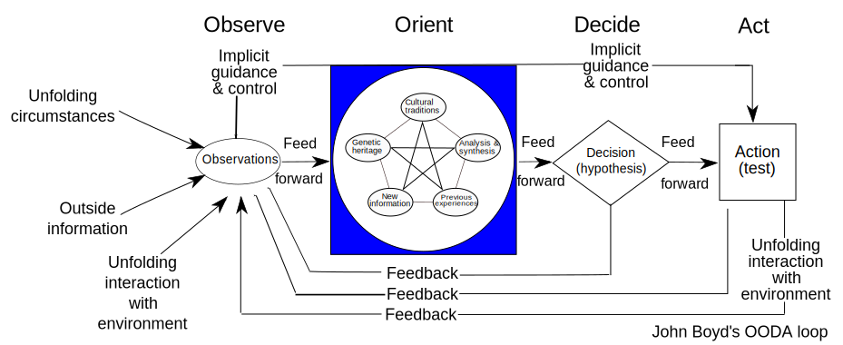

# OODA Flow Diagram

## Background & Purpose

OODA loop is a great management tool of projects on cyber security, data science, research and others. However, as the project progressed, in many cases, the main purpose might be lost or the history of the project was forgotten between those members. Therefore, in order to solve these issues, I designed "OODA Flow Diagram."

I'm a data scientist, so I have especially focused on data science projects and often used this flow diagram for  them.

* Clarify the purpose of the project and share it among team members to prevent it from missing it.
* To make the next decision quickly by being able to visually see the history of acts and outputs.

## [OODA Loop](https://en.wikipedia.org/wiki/OODA_loop)

The OODA loop is the cycle observe–orient–decide–act, developed by military strategist and United States Air Force Colonel John Boyd. Boyd applied the concept to the combat operations process, often at the operational level during military campaigns. It is now also often applied to understand commercial operations and learning processes. 



## Concept and Basic Steps

This flow consists of the following steps based on OODA Loop.

### Major Target

First, to clarify the Major Target. It is a ultimate goal of the project and the end condition of the project. This step is so important that project members should always be reminded of their goals, such as when a problem arises and the solution is considered. `MajorTarget` of the flow diagram is used to show this.

If prerequisites are with the major target, to summarize them. `MajorPrerequisite`of the flow diagram is used to show this.
For example:

* Input data 
* Dead line


### First OODA Loop

1. Set the first small target.
2. Do OODA Loop to achieve the small target.
3. Summarize the result of the loop.

`Cluster` makes easier to see this loop unit in the flow diagram.


#### Set Small Target / First Step

It is difficult to suddenly achieve the major target, so it is divided into smaller goals, and determine the first step. That is the first small Target. `Target` of the flow diagram is used to show it.


#### Observe - Orient - Decide(OOD)

This phase decides the TODOs of the next Act from input information and current status . The output of this phase  is a `ActTable` of the flow diagram. `ActCells` basically consists of the followings:

* Todo
* Output
* By When
* Who
* Progress

By clarifying them, Act phase will proceed smoothly.

Notes: It's not necessary to record what you did in this OOD phase, the above factors are important.


#### Act

Act the TODOs that was decided in the OOD phase, and create outputs. When the act has finished, you should update TODOs and Outputs to match what you actually did.

* If you find that you shouldn't proceed as it is, close this act by summarizing the conclusion in the output of `ActCells` and go to the next OOD phase,  or set another target
* If the TODOs or outputs increase or change a little while you are working on the act, you can update them.

#### Loop

Repeat OOD and Act loop until achieving the first small target.

#### Result

When the small target is achieved, memorize the conclusion of the step with`Result`. 
For Example:

* Final Outputs
* Whether the small target is achieved or not.


### Next & Repeat OODA Loop 

After achieving the previous target, set the next small target and run the OODA loop again. We will repeat this cycle until achieving the Major target.


## OODA Flow Diagrams as Code

This codes is the folk of Diagrams. OODA Flow Diagrams as Code let you draw the flow diagram in Python code.

### Getting Started


### Diagram Nodes

#### Major Target

```python
major_target = MajorTarget(
            label="Binary classification prediction of reservations with 
    			　 "high hotel cancellation probability.")

```


| parameter   | type                     | required | default        | detail                                                       |
| ----------- | ------------------------ | -------- | -------------- | ------------------------------------------------------------ |
| label       | string<br />List[string] | ✓        |                | Strings showed in the node. If the type is list, it becomes bullet points. |
| line_mark   | str                      |          | 'point'        | If the label is itemized, this can be selected.<br />- 'point':  line mark becomes point<br />- 'seq': line mark becomes sequential numbers (1,2,3,,,) |
| line_length | int                      |          |                | The number of characters per line of label. Line breaks are automatically inserted for each specified value. |
| subject     | string                   |          | 'Major Target' | Set subject in [ ].                                          |

#### Target

```python
firs_target = Target(label="Select the first and simple features, and binary classify.")
```


Parameters are the same as the above Major Target.

#### ActTable

```python
histgram1 = ActTable(
    todo="check all features' histgrams", 
    bywhen="6/23", who="James", progress="done",
    output="selected 8 features", completed_date="6/22")
```


| parameter   | type                     | required | default | detail                                                       |
| ----------- | ------------------------ | -------- | ------- | ------------------------------------------------------------ |
| todo        | string<br />List[string] | ✓        |         | Strings showed in the todo cell. If the type is list, it becomes bullet points. |
| todo_mark   | str                      |          | 'point' | If todo is itemized, this can be selected.<br />- 'point':  line mark becomes point<br />- 'seq': line mark becomes sequential numbers (1,2,3,,,) |
| output      | string<br />List[string] |          |         | Strings showed in the output cell. If the type is list, it becomes bullet points. |
| output_mark | str                      |          | 'point' | If output is itemized, this can be selected.<br />The items are the same as the todo_mark. |
| output_link | str                      |          |         | String of the output contents link: ( e.g. file path, URL)   |
| line_length | int                      |          |         | The number of characters per line of label. Line breaks are automatically inserted for each specified value. |
| bywhen      | string                   |          |         | The deadline of this todo.                                   |
| who         | string                   |          |         | Show who does this todo.                                     |
| progress    | string                   |          |         | Show the progress circle.<br />'start', '25', '50', '75', 'Done' |


#### Result 

```python
first_result = Result(label="First accuracy is accuracies_01.xls. That is not enough.")
```


Parameters are the same as the above Major Target.


